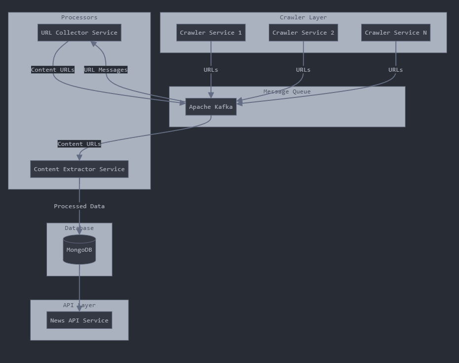

## Design



## Project setup

```bash
$ docker-compose -f kafka-docker-compose.yml up -d
```

```bash
$ npm install
```

```bash
$ export NODE_ENV=development
$ cp .env.example .env.development
```

## Compile and run the project

```bash
# development
$ npm run start

# watch mode
$ npm run start:dev

# build
$ npm run build

# production mode
$ npm run start:prod
```

## PM2

```bash
$ pm2 start dist/main.js -i 4 --name my-crawler
```

## Indexs

```typescript
NewsArticleSchema.index({ createdAt: -1 });
NewsArticleSchema.index({ category: 1, createdAt: -1 });
```

## API Get

<http://localhost:3000/v1/news?category=kinh-doanh>
